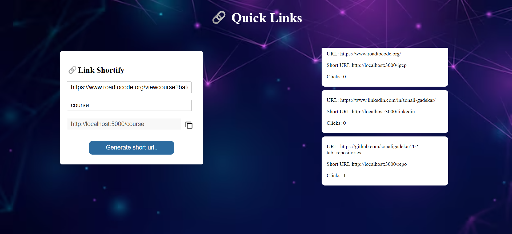

# Quick Links
Quick Links streamlines your online experience by converting long URLs into short, shareable links with just a few clicks. 

## Project's Purpose
Quick Links simplifies your life by effortlessly converting long URLs into short ones.On this site, users paste a long URL and the tool shortens it for easy sharing and
remembering.

## Description
Quick Links is a handy tool that simplifies your online experience by turning long, complicated URLs into short and easy-to-share links. With just a few clicks, you can input a lengthy web address, and Quick Links will generate a concise link that redirects to the original destination.

## Real-Life Usefulness:
It is mostly used in client meeting in company, teacher meeting.

